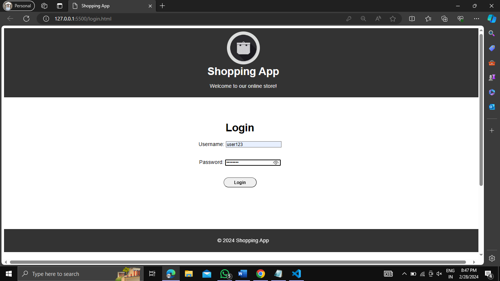
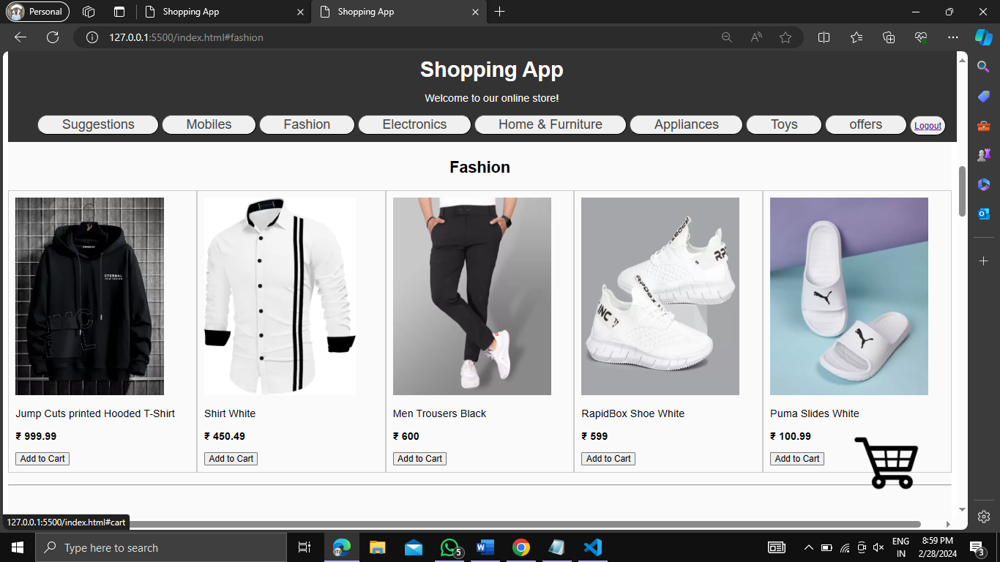
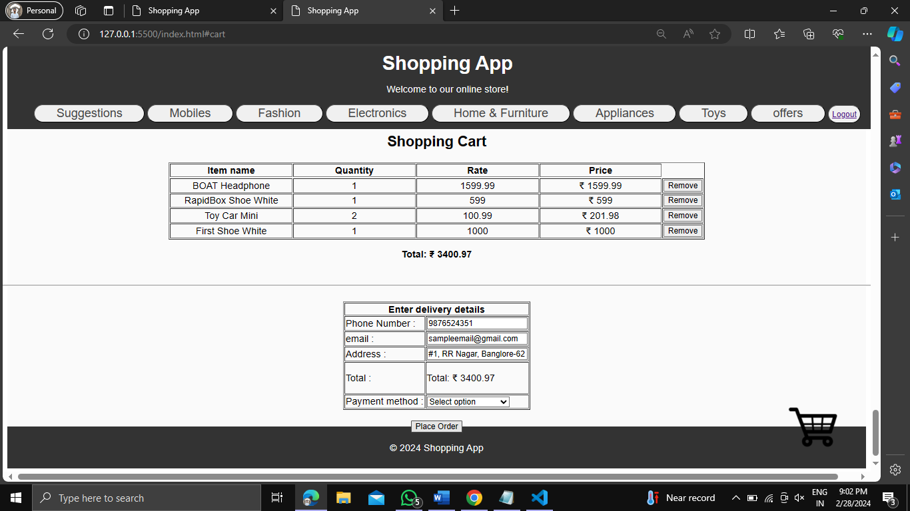

# ShoppingWebsite
An AngularJS shopping website uses Angular's framework to create a dynamic and interactive shopping experience. Components
handle product displays, user carts, and checkout processes, all while keeping the user interface clean and responsive.

sample
1 

2 

3 
